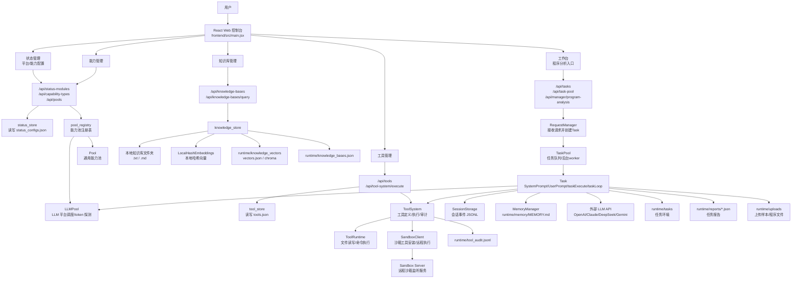
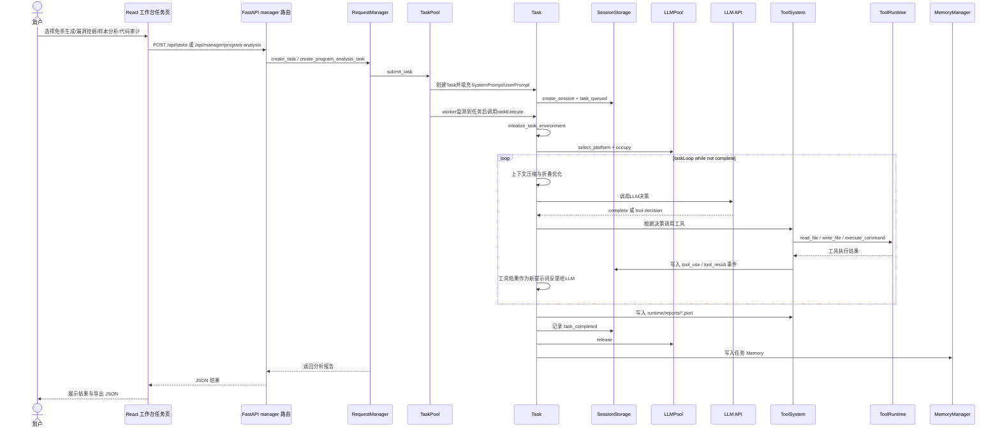
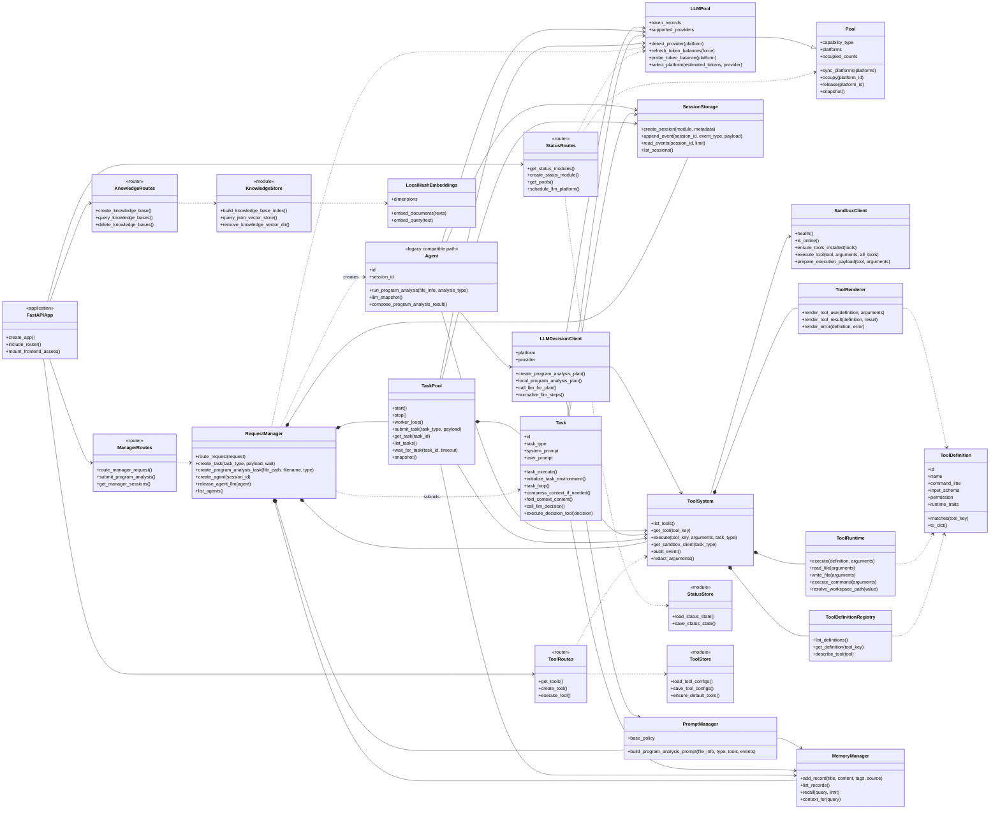

# CodeX 工作逻辑图与类对象关系图

本文档基于当前代码结构绘制，重点覆盖前端工作台、Task Pool、FastAPI 路由、后端服务对象、运行态数据和任务循环链路。

## 工作逻辑图

## Task Pool 任务链路

## 类对象关系图

## 图例说明

- `runtime/` 是当前平台的本地持久化中心，保存配置、会话、上传文件、报告、工具审计、Task运行目录和 Memory。
- `state.py` 在应用启动时组装全局对象，包括 `TaskPool`、`RequestManager`、`ToolSystem`、`SessionStorage`、`MemoryManager` 和 LLM 池。
- 能力类型为 `沙箱` 且在线时，`样本分析` 和 `漏洞挖掘` 任务中的工具调用会经由 `SandboxClient` 转发到远程 `sandbox_server.py`。
- 前端目前主要是 React 函数组件，不是类组件；“类对象关系图”重点展示后端服务类、路由模块和存储模块之间的关系。
